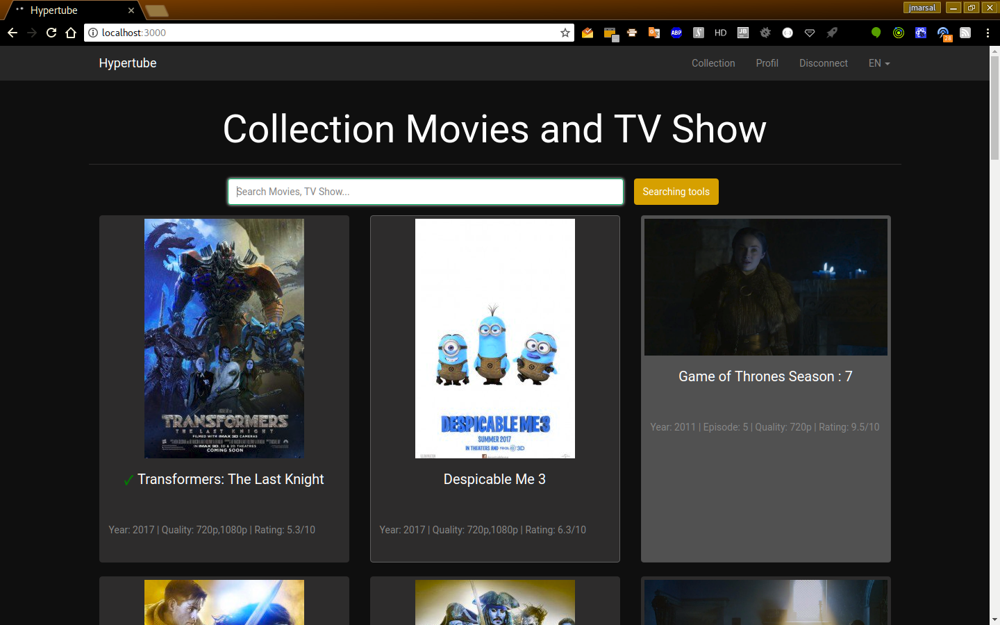
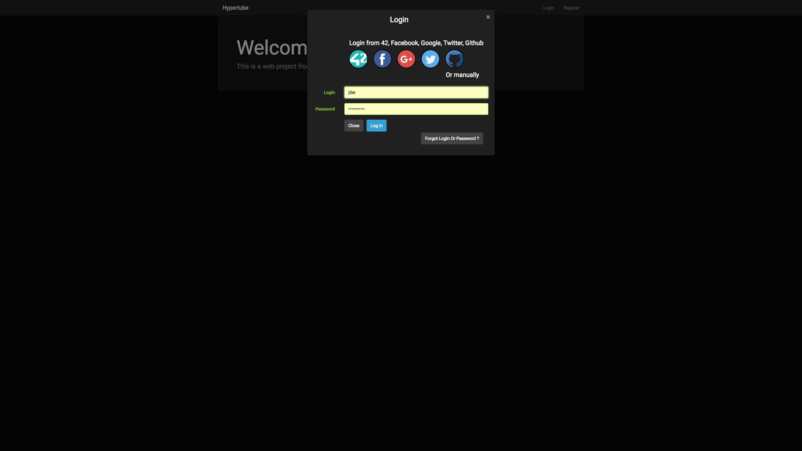

****

## Contributeurs
[@jmarsal](https://github.com/jmarsal) | [@pwortham](https://github.com/pwortham) | [@WingardiumJKEULEYA](https://github.com/WingardiumJKEULEYA)

# Projet Hypertube 42
Ce projet vous propose de créer une application web permettant à un utilisateur de
rechercher et visionner des vidéos.
Le lecteur sera directement intégré au site, et les vidéos seront téléchargées au travers
du protocole BitTorrent.
Le moteur de recherche interrogera plusieurs sources externes de votre choix, comme
par exemple **http://www.legittorrents.info**, ou encore **https://archive.org**.
Une fois un élément sélectionné, il sera téléchargé sur le serveur et diffusé sur le player
web en même temps. Autrement dit, le lecteur ne se contentera pas d’afficher la vidéo
une fois le téléchargement complété, mais sera capable de streamer directement le flux.

## Stack
NodeJS - Express - React - Redux - MongoDB - SASS - CSS

## Manuel
Requière **NodeJs** >= `8.1.2` && **NPM** >= `5.0.3` || **Yarn** >= `0.24.6` && **MongoDB** >= `3.4.4`
1. Avec Yarn
    1. yarn
    2. yarn run prod
2. Avec NPM
    1. npm install
    2. npm run prod
3. Sur chrome ou firefox => [localhost:3000](http://localhost:3000/)
4. Enjoy mais **attention, ce projet n'est pas destiné à être publié et / ou commercialisé. Il est uniquement fait dans un but pedagogique. Toute utilisation sera de votre responsabilité !**

## API RESTful
### COLLECTION

`POST api/collection/getCollectionByTitleForClient`
-> Get list of all movies

`POST api/collection/getGenresInCollection`
-> Get all genre in DB for filters

`POST api/collection/getQualityInCollection`
-> Get all quality in DB for filters

`POST api/collection/getSeasonsInCollection`
-> Get all quality in DB for filters (Seasons)

`POST api/collection/getMinMaxImdbNote`
-> Get min and max IMDB notes for filters

`POST api/collection/getMinMaxYears`
-> Get min and max IMDB years for filters

`GET api/collection/getmoviedetails/:movieID`
-> Get movie details by movieID
>_movieID : Integer_

### COMMENTS
`GET api/comments/:id`
-> Get comment by movieID 
>_id : Integer_

`POST api/comments`
-> Add comment to movie

### USERS FILE

`GET api/users/onebylogin/:userLogin`
-> Get firstname/lastname/username/img from userLogin
>_userLogin : String_

`PUT api/users/:id`
-> Update current user
>_id : Integer_

`POST api/users/upload`
-> Update user image

